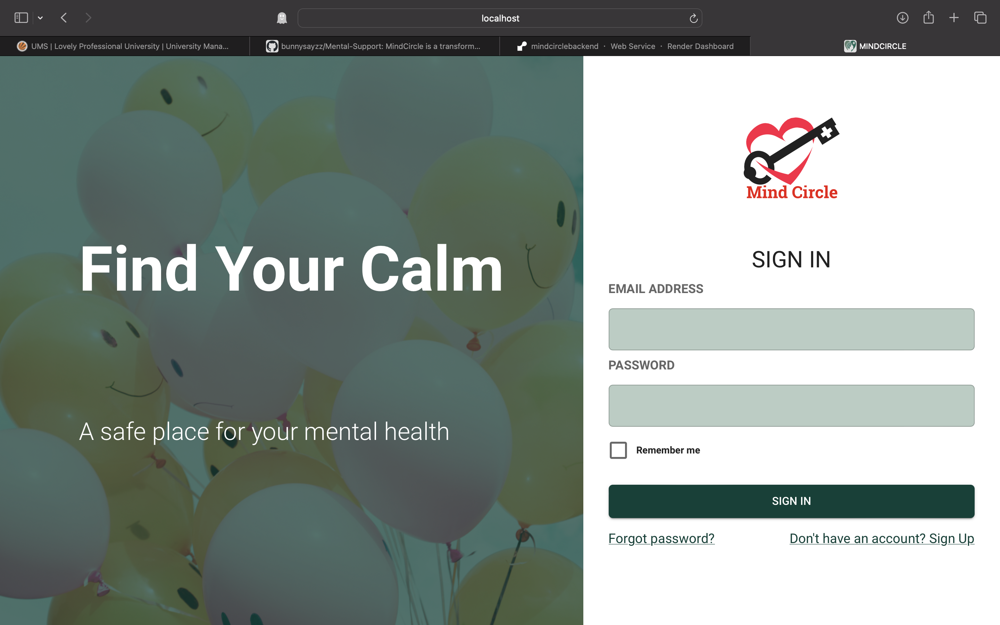
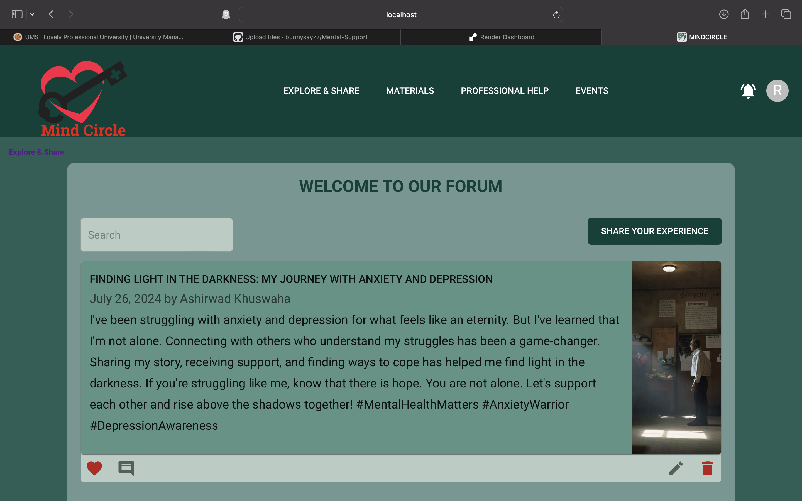

# Project Title: MindCircle

## Overview
MindCircle is a transformative web application designed to cultivate a supportive community of individuals and healthcare professionals. Within this platform, practitioners can recommend soothing music and enriching reading materials, such as books, to assist individuals in overcoming their challenges. Participants can share their personal experiences, while healthcare providers can update events for community engagement.

## Login Page


## Main Page


## Features
- Secure user authentication
- Seamless file uploads to Cloudinary
- Comprehensive management of reading materials
- Responsive and user-friendly design

## Installation and Setup

### Prerequisites
- Node.js (version 14 or higher)
- npm (Node Package Manager)
- MongoDB (for database management)

### Backend Setup
1. Navigate to the backend directory:
   ```bash
   cd backend
   ```

2. Install the necessary dependencies:
   ```bash
   npm install
   ```

3. Create a `.env` file in the backend directory and include the following environment variables:
   ```
   CLOUD_NAME=your_cloud_name
   CLOUD_API_KEY=your_api_key
   CLOUD_API_SECRET=your_api_secret
   MONGODB_URI=your_mongodb_uri
   ```

4. Launch the backend server:
   ```bash
   npm run dev
   ```

### Frontend Setup
1. Navigate to the frontend directory:
   ```bash
   cd frontend
   ```

2. Install the required dependencies:
   ```bash
   npm install
   ```

3. Start the frontend application:
   ```bash
   npm start
   ```

## Usage
- Access the application at `http://localhost:3000` in your web browser.
- Utilize the login page to authenticate and explore the main features of the application.

## Contributing
Contributions are warmly welcomed! Please submit a pull request or open an issue for any enhancements or bug fixes.

